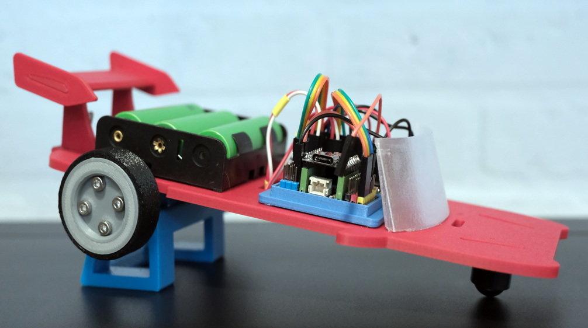

# N20 Car App

#
The N20 Car is an easy to create robot car that uses two N20 DC motors. You can find a full description of the build process and the collection of 3D printable files at: https://www.printables.com/model/1798744-n20-toy-car  

This respository is for the remote app to control the car. You can either use this repo to build the app yourself, or you can use the latest web build at: https://dawied.github.io/n20carapp/  
  
The app has a Joystick control to steer the car, speed and steering strength sliders and a nice recording function to record and playback drives.

You find the Arduino code in the directory /firmware/n20car, or you can download the ino file from the app itself

## Getting Started

1. Build the car (go to: https://www.printables.com/model/1798744-n20-toy-car to find the BOM, Instructions and stl files)
2. Upload the Arduino code to your microcontroller
3. Start the app and have fun driving!